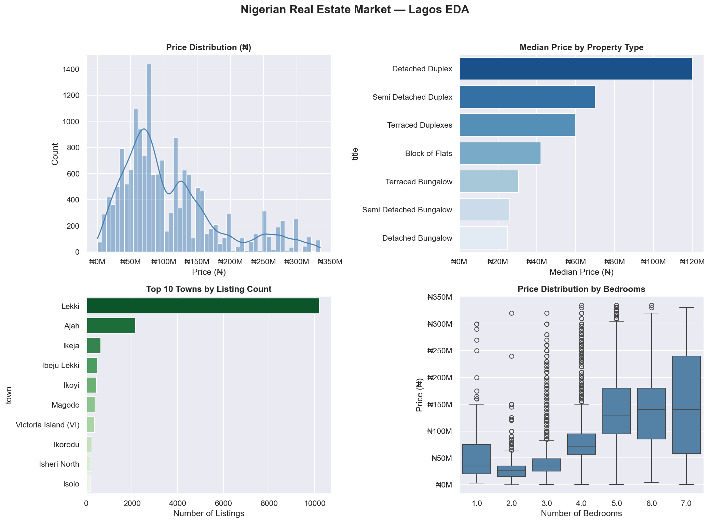
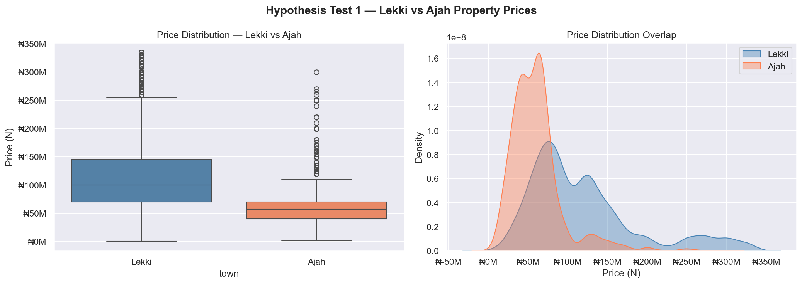
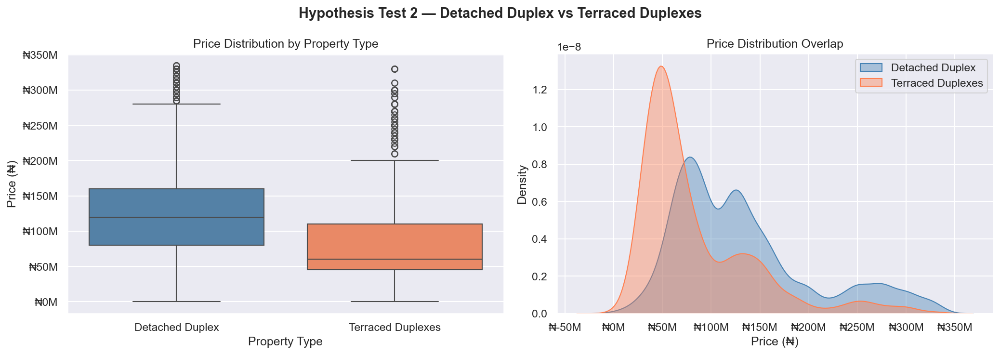
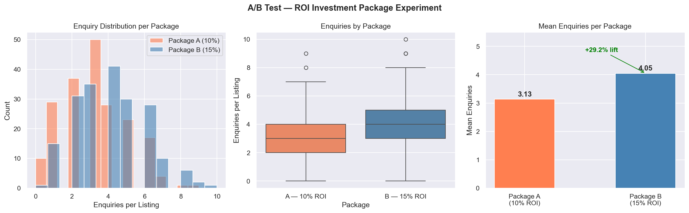

# Nigerian Real Estate Statistical Analysis

Statistical analysis of Nigerian housing market data using Python,
Pandas, and SciPy. Built to complement hands-on reporting experience
at a Nigerian real estate firm with rigorous statistical framing.

## Key Findings

| Finding | Result | P-value |
|---------|--------|---------|
| Lekki vs Ajah price difference | Lekki is **75% more expensive** | < 0.000001 |
| Detached vs Terraced Duplex premium | Detached commands **2x the price** | < 0.000001 |
| 15% vs 10% ROI package enquiries | 15% ROI generates **+29.2% more enquiries** | 0.000001 |

---

## Exploratory Data Analysis

Key observations:
- Lagos property prices cluster between ₦50M and ₦150M
  after outlier removal
- Detached Duplexes command the highest median price
  across all property types
- Lekki accounts for 45% of all Lagos listings
- Price increases consistently with bedroom count

---

## Hypothesis Test 1 — Lekki vs Ajah

**Question:** Do Lekki properties price significantly higher than Ajah?

| Metric | Lekki | Ajah |
|--------|-------|------|
| Listings | 10,213 | 2,139 |
| Median price | ₦100,000,000 | ₦57,000,000 |
| Mean price | ₦119,453,016 | ₦60,783,167 |

**T-statistic:** 37.88 · **P-value:** < 0.000001 · **Decision: Reject H₀**

**Business implication:** Lekki commands a 75% price premium over
Ajah — statistically reliable across 12,352 listings. Investors
targeting capital appreciation should prioritise Lekki. Buyers
seeking value within the Lagos corridor should consider Ajah.

---

## Hypothesis Test 2 — Detached Duplex vs Terraced Duplexes

**Question:** Do Detached Duplexes price significantly higher
than Terraced Duplexes?

| Metric | Detached Duplex | Terraced Duplexes |
|--------|----------------|-------------------|
| Listings | 10,080 | 2,062 |
| Median price | ₦120,000,000 | ₦60,000,000 |
| Mean price | ₦131,430,704 | ₦83,134,345 |

**T-statistic:** 28.79 · **P-value:** < 0.000001 · **Decision: Reject H₀**

**Business implication:** Detached Duplexes command exactly double
the median price of Terraced Duplexes. For a sales team, Detached
listings require a different buyer profile and financing strategy.

---

## A/B Test — ROI Investment Package Experiment

**Scenario:** A property investment platform tested two packages
over 30 days across 400 listings (200 per package):
- **Package A (Control)** — Standard 10% annual ROI offer
- **Package B (Treatment)** — Enhanced 15% annual ROI offer

**Metric:** Number of buyer enquiries per listing

| Metric | Package A (10%) | Package B (15%) |
|--------|----------------|----------------|
| Listings | 200 | 200 |
| Mean enquiries | 3.13 | 4.05 |
| Std deviation | 1.79 | 1.90 |
| Enquiry lift | — | **+29.2%** |

**T-statistic:** 4.95 · **P-value:** 0.000001 · **Decision: Reject H₀**

> **Note:** Enquiry data was simulated using a Poisson distribution
> — the appropriate distribution for count data. Assumptions are
> documented explicitly. The statistical methodology is identical
> to what would be applied on live experiment data.

**Business implication:** The 15% ROI package generates ~1 additional
enquiry per listing. Across 200 active listings that is approximately
180 additional buyer touchpoints per campaign cycle.

**Recommendation:** Roll out Package B across all listings.

---

## Dataset

Nigerian House Price Dataset — 24,326 property listings across
Nigerian towns and states.

- **Source:** [Kaggle](https://www.kaggle.com/datasets/michaelanietie/nigerian-house-price-dataset)
- **Features:** bedrooms, bathrooms, toilets, parking spaces,
  property title, town, state, price (₦)
- **Clean sample:** 16,510 Lagos listings after IQR outlier removal

---

## Stack

Python · Pandas · NumPy · SciPy · Matplotlib · Seaborn · Jupyter Notebook

---

## Methods

| Category | Detail |
|----------|--------|
| Statistical test | Independent samples t-test (one-tailed) |
| Outlier removal | IQR — Tukey method, 1.5x threshold |
| Simulation | Poisson distribution, NumPy random seed 42 |
| Significance level | α = 0.05 throughout |

---

## Author

Kingsley Eloebhose — Data Analyst & ML Practitioner
[kingsleyelo.github.io](https://kingsleyelo.github.io) ·
[LinkedIn](https://www.linkedin.com/in/kingsley-eloebhose-77ab41379)